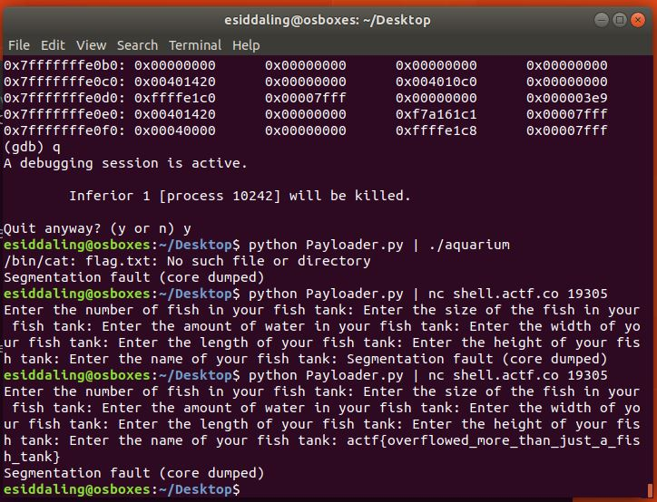

# Aquarium

## Challenge

"Here's a nice little [program](aquarium) that helps you manage your [fish tank](aquarium.c).
Run it on the shell server at /problems/2019/aquarium/ or connect with nc shell.actf.co 19305"

## Process

We are given the elf file for a program as well as the c file for the program. After looking at the c file we can determine that in order to solve the challenge we need to somehow jump into the function flag from the create_aquarium function. The program uses the function gets() which is vulnerable to a buffer overflow attack. Buffer overflow vulnerablities allow parts of the stack to be over written with arbitrary data.

We want to overwrite the return address of this function as the address of the function flag. From an objectdump of the elf file we can determine that the address for the flag function is 0x004011a6, which we want to jump to. 

However, we don't want to trash too much of the stack, so we want to also rewrite 0x00007fff before the address of the flag function. I reversed the address of the function flag in my program below in order to account for endianness.

I wrote the python program below in order to perform the buffer overflow. I overwrote all of the stack until the return address with a's and rewrote the return address with the address of the function flag.

[I wrote this python program in order to perform the buffer overflow.](Payloader.py)

My program performing the bufferoverflow exploit:

The flag is actf{overflowed_more_than_just_a_fish_tank}
