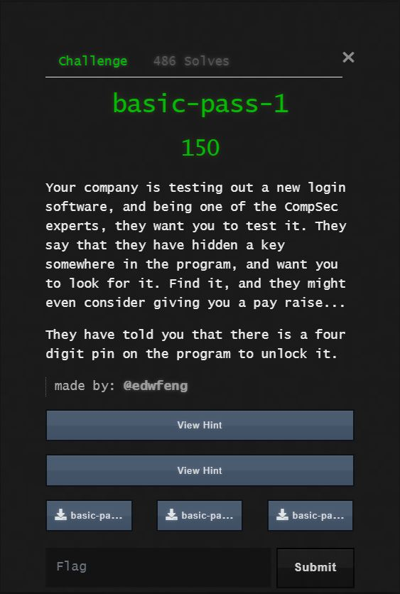
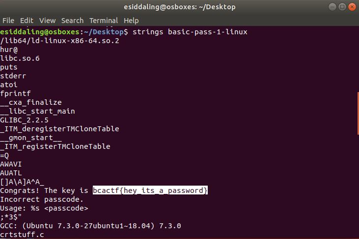

# basic-pass-1

## ChallengeYour

"Your company is testing out a new login software, and being one of the CompSec experts, they want you to test it. They say that they have hidden a key somewhere in the program, and want you to look for it. Find it, and they might even consider giving you a pay raise...

They have told you that there is a four digit pin on the program to unlock it."

You can download the problem file here [basic-pass-1-linux](basic-pass-1-linux)

## Process

I simply ran strings on the file and found the flag.

The flag is bcactf{hey_its_a_password}