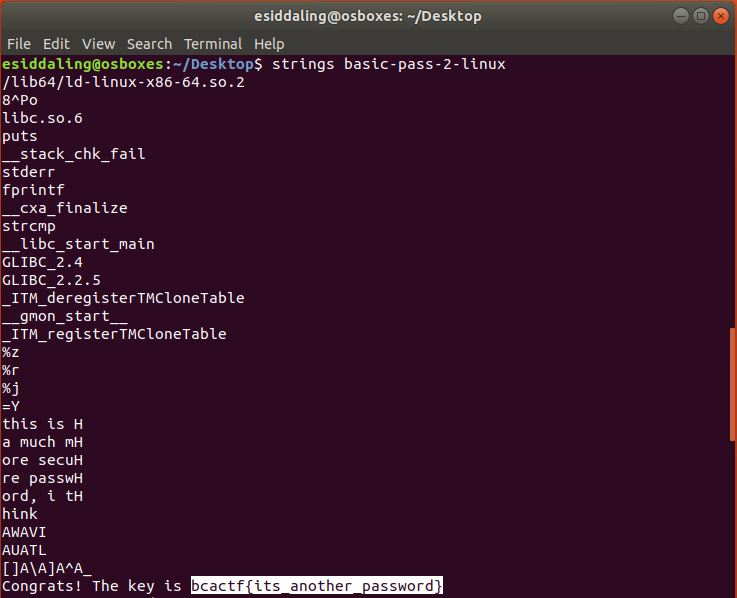

# basic-pass-2

## Challenge

"Your company is testing out its new employee portal. After your previous shot, they made the password a bit more secure, so you can't brute force it anymore. Rise up to the occasion and demonstrate why a local machine is a bad idea, and having the account credentials on a remote server is a better idea."

You can download the problem file here [basic-pass-2-linux](basic-pass-2-linux)

## Process

Once again, I simply ran strings on the given  file and found the password. I'm not sure if this was the intended solution however.

The flag is bcactf{its_another_password}