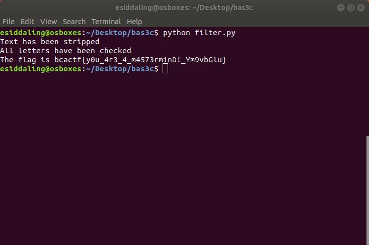

# basic-pass-3

## Challenge

"Ok, the sysadmin finally admits that maybe authentication should happen on a server. Can you just check everything really quick to make sure there aren't any problems now? He put some readouts for people who forget their passwords.

nc challenges.ctfd.io 30133"

## Process

First I tried inputting lots of random characters in order to determine the pattern. I determined that the flag is 38 chars long, and a space correlates with a 1 if the character inputted at that space is the same character as the character at the same space in the flag.


I then created [this](spam.py) python program to input all keyboard characters so I could determine pieces of the flag.

```
keyChars = ' !"#$%&\'()*+,-./0123456789:;<=>?@ABCDEFGHIJKLMNOPQRSTUVWXYZ[]^_`abcdefghijklmnopqrstuvwxyz{|}~'

for char in keyChars:
	print char*38
```

I piped the output of this program into the file [unfiltered.txt](unfiltered.txt) so I could interpret it more easily.

```
$ (python spam.py | nc challenges.ctfd.io 30133) > unfiltered.txt
```


Next I created [this]{filter.py) python program to filter through the output from the last python program and piece together the flag.

```
keyChars = ' !"#$%&\'()*+,-./0123456789:;<=>?@ABCDEFGHIJKLMNOPQRSTUVWXYZ[]^_`abcdefghijklmnopqrstuvwxyz{|}~'

unfiltered = open('unfiltered.txt', 'r')
unfiltered_text = unfiltered.readlines()

stripped_text = []
for line in unfiltered_text:
	if line != 'Enter the password.\n' and line != 'welcome to the login portal.\n':
		line = line.strip('\n')
		stripped_text.append(line)

#print(stripped_text)
print "Text has been stripped"

flag = ['.','.','.','.','.','.','.','.','.','.','.','.','.','.','.','.','.','.','.','.','.','.','.','.','.','.','.','.','.','.','.','.','.','.','.','.','.','.']

#print flag


for i in range(0,len(stripped_text)):
	line = stripped_text[i]
	for j in range(0,len(line)):
		char = line[j]
		if char == '1':
			flag[j] = keyChars[i]
#	print "Checking " + str(keyChars[i])
#			print flag
#print flag
print ("All letters have been checked")

temp = ''
for k in flag:
	temp = temp + str(k)

flag = temp
print('The flag is ' + flag)
#The flag is bcactf{y0u_4r3_4_m4573rm1nD!_Ym9vbGlu}
```



The flag is bcactf{y0u_4r3_4_m4573rm1nD!_Ym9vbGlu}
