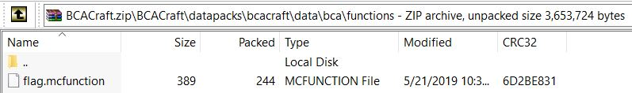

# bca-craft

## Challenge

"Yo I made a sic Minecraft adventure MAP! Try it out it's kewler than ur Fortnite gamez!

(This map runs in Minecraft 1.13.2 and above)"

You can dowload the problem file here [BCACraft.zip](BCACraft.zip)

## Process

I opened up the zip file and navigated through the directories until I found this file.



Inside flag.mcfunction I found this text.

```
tellraw @a ["Hello ", {"selector": "@p", "color": "yellow"}, "! The flag is: ", "b", "c", "a", "c", "t", "f", "{", {"text": "m1n3cr4f7_b347s_f0rtn1t3", "color": "blue", "bold": true, "obfuscated": true, "hoverEvent": {"action": "show_text", "value": {"text": "Good luck! ", "extra": [{"text": "Hint: Where does Minecraft store its worlds?", "color": "dark_gray", "italic": true}]}}}, "}"]
```

m1n3cr4f7_b347s_f0rtn1t3 looked like the flag so I put it in the flag format and it was correct.

The flag is bcactf{m1n3cr4f7_b347s_f0rtn1t3}