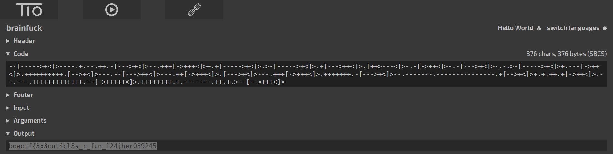

# executable

## Challenge

"It's in there somewhere. Good luck!"

You can download the problem file here [executable-ubuntu](executable-ubuntu)

## Process

I ran strings on the executable and saved the output to a file [exec.txt](exec.txt).

```
$ strings executable-ubuntu > exec.txt
```

Inside the file I found something interesting.

```
--[----->+<]>----.+.--.++.-[--->+<]>--.+++[->+++<]>+.+[----->+<]>.>-[----->+<]>.+[--->++<]>.[++>---<]>-.-[->++<]>-.-[--->+<]>-.-.>-[----->+<]>+.---[->++<]>.++++++++++.[-->+<]>---.--[--->++<]>---.++[->+++<]>.[--->+<]>---.+++[->+++<]>.+++++++.-[--->+<]>--.-------.---------------.+[-->+<]>+.+.++.+[->++<]>.--.---.+++++++++++++.--[->+++++<]>.++++++++.+.-------.++.+.>--[-->+++<]>.
```

This collection of dashes, brackets, less than signs, greater than signs, plus signs, and preiods is an esoteric language called brainfuck. I ran it on tio.run and got the flag.



The flag is bcactf{3x3cut4bl3s_r_fun_124jher089245}