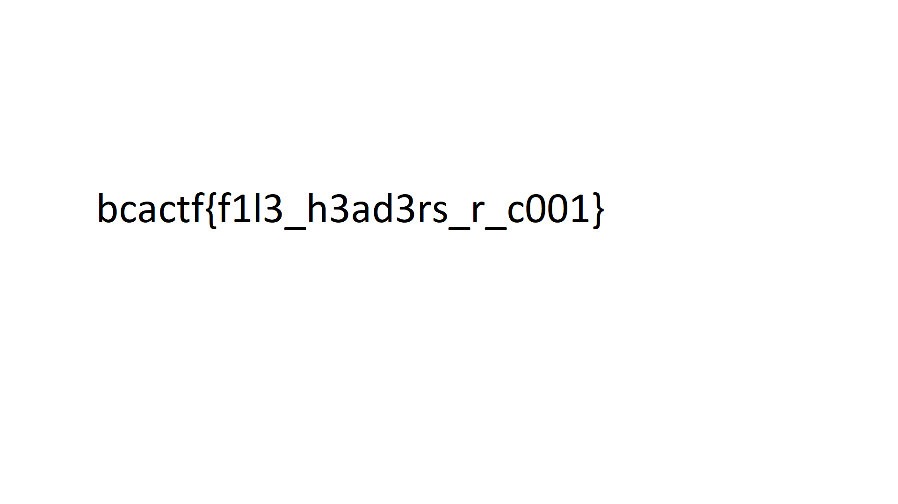

# file-head

## Challenge

"It looks like the PNG file that holds our flag has been corrupted. My computer isn't able to recognize the file type, maybe it has something to do with how the file type is recognized..."

You can download the problem file here [flag.png](flag.png)

## Process
At first I tried opening the file with photos, and I found that the file was broken. I then opened the file with HxD and found that the file header for this png file was missing.

I found out that the file header for a png in decimal is 137 80 78 71 13 10 26 10 from http://www.libpng.org/pub/png/spec/1.2/PNG-Structure.html.

I then converted convert this decimal to hex and got 89 50 4E 47 0D 0A 1A 0A. I changed the file's first seven hexadecimal digits to this and saved the file. Be careful that you don't insert new digits to the file, and instead overwite the file header.

The flag was clearly displayed in the fixed image.

The flag is bcactf{f1l3_h3ad3rs_r_c001}