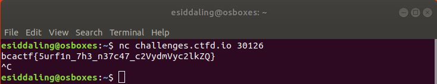

# net-cat

## Challenge

"Some problems in this CTF will require you to use netcat to access server-side problems.

For this problem netcat in to our server by using

nc challenges.ctfd.io 30126"

## Process

I simply connected to the server and got the flag.

```
$ nc challenges.ctfd.io 30126
```



The flag is bcactf{5urf1n_7h3_n37c47_c2VydmVyc2lkZQ}