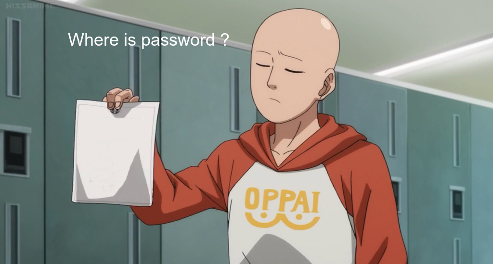
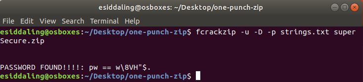
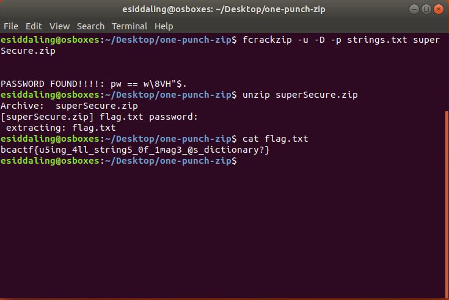

# one-punch-zip

## Challenge

"One Punch Man seemed to have lost the password to his super secret archive. Can you help him crack it?"

You can download the problem file here [superSecure.zip](superSecure.zip)

## Process

At first I tried bruteforcing the password of the zip file with fcrackzip, but that was taking a very long time.

```
$ fcrackzip -b -c 'a' -l 1-16 -u superSecure.zip
```

Next I opened up the image, but I didn't find anything immediately interesting.



I then tried running strings on the image and saving the output, but I found nothing that immediately seemed like a password. 

```
$strings opm.png > strings.txt
```

I then tried using a dictionary attack on the zip file with [strings.txt](strings.txt) as the dictionary.

```
$ fcrackzip -u -D -p strings.txt superSecure.zip
```

This was able to successfully crack the password. The password is w\8VH"$.



I then unzipped the zip file with the password and found a file called [flag.txt](flag.txt). Within that file was the flag.



The flag is bcactf{u5ing_4ll_string5_0f_1mag3_@s_dictionary?}
