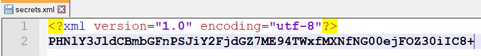
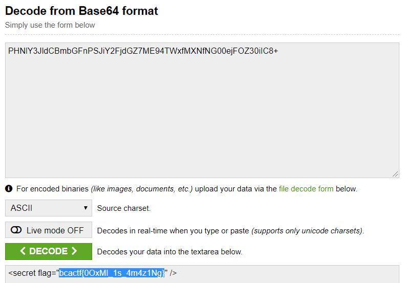

# open-docs

## Challenge

"Yay! I really enjoy using these free and open file standards. I love them so much, that I made a file expressing how much I like using them. Let's enjoy open standards together!"

You can download the problem file here [open.docx](open.docx)

## Process

First I opened the docx file, but I didn't find anything interesting. docx files are different than doc files because they can be unzipped, so I tried renaming the file to [open.zip](open.zip) and unzipping it.

Inside the folder word, I found a file called secrets.xml with base64 text in it.

I then converted PHNlY3JldCBmbGFnPSJiY2FjdGZ7ME94TWxfMXNfNG00ejFOZ30iIC8 to ASCII using an online converter to get the flag.

The flag is bcactf{0OxMl_1s_4m4z1Ng}