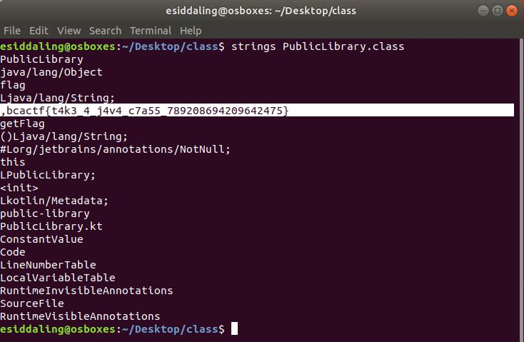

# public-library

## Challenge

"Hidden in this mysterious public library is the flag. Can you get it?"

You can download the problem file here [PublicLibrary.class](PublicLibrary.class)

## Process

I ran strings on the file and found the flag.

```
$ strings PublicLibrary.class
```



The flag is bcactf{t4k3_4_j4v4_c7a55_789208694209642475}