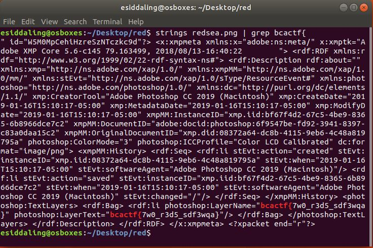

# split-the-red-sea

## Challenge

"Moses used a staff to split the Red Sea. What will you use?"

You can download the problem file here [redsea.png](redsea.png)

## Process

I ran strings on the file and used grep to find the flag.

```
$ strings redsea.png | grep bcactf{
```



The flag is bcactf{7w0_r3d5_sdf3wqa}