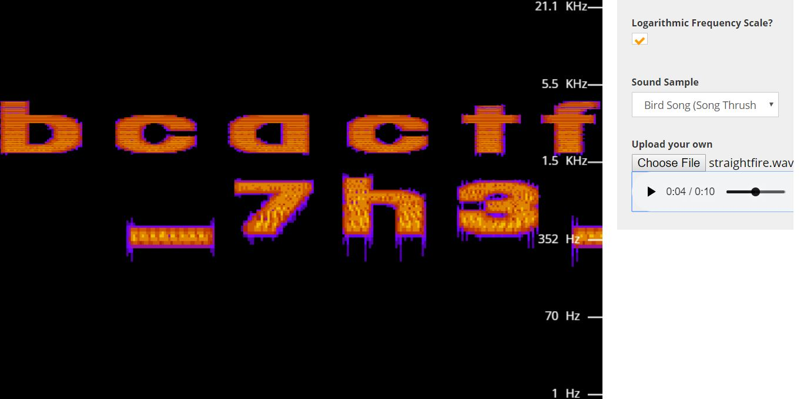
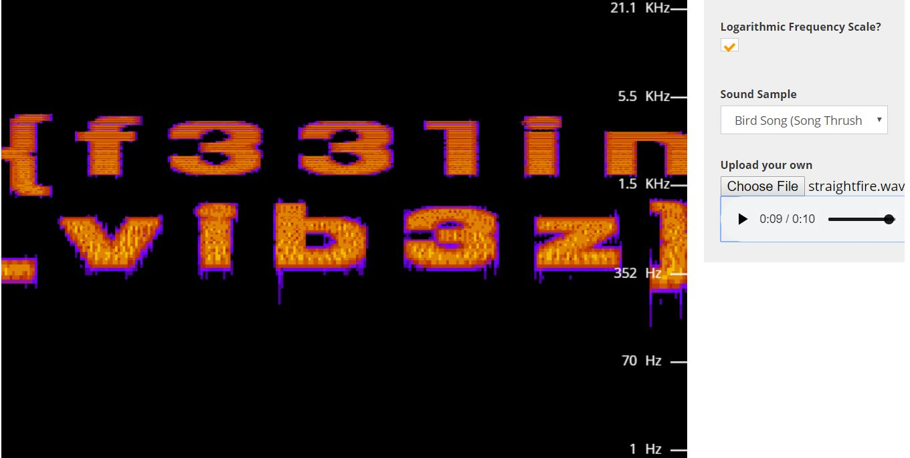

# wavey

## Challenge

"My friend sent me his new mixtape, but honestly I don't think it's that good. Can you take a look at it and figure out what's going on?"

You can download the problem file here [straightfire.wav](straightfire.wav)

## Process

First I tried listening to the given wav file. I heard a lot of painful high pitched sounds and would not recommend listening to it with headphones.

I realized that this was a spectrum analyzer problem and used this website https://academo.org/demos/spectrum-analyzer/ to find the flag.

The flag is bcactf{f331in_7h3_vib3z}