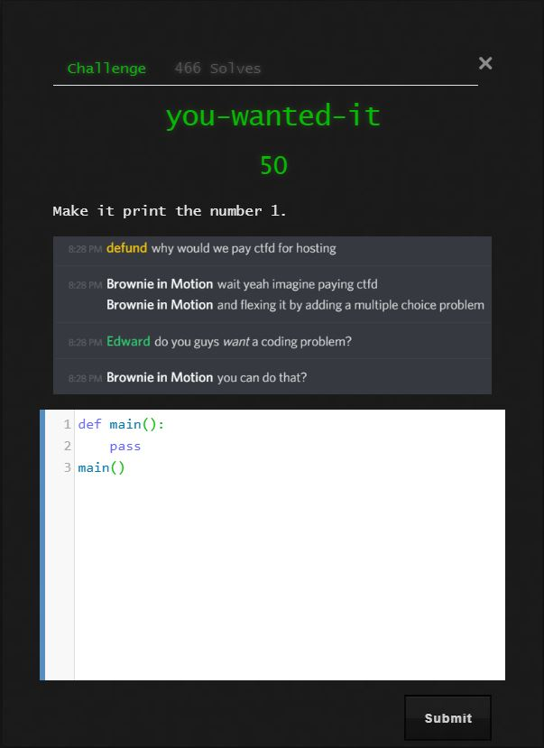
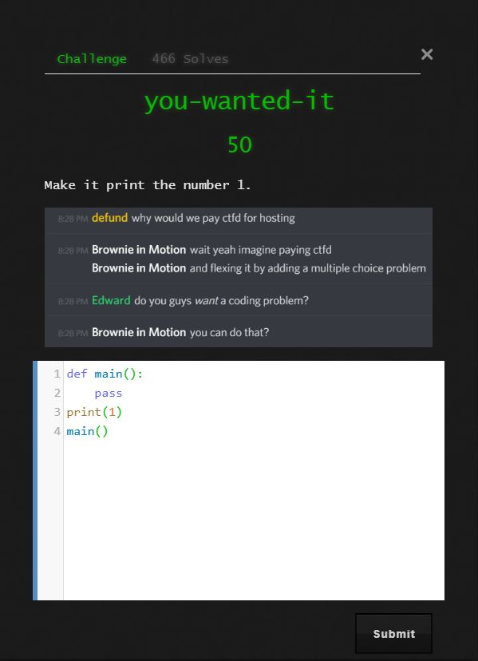

# you-wanted-it

## Challenge

"Make it print the number 1."

## Process

The challenge origionally looked like this.



I just added the line

```
print(1)
```

and was successful.



(There was no traditional flag for this problem)