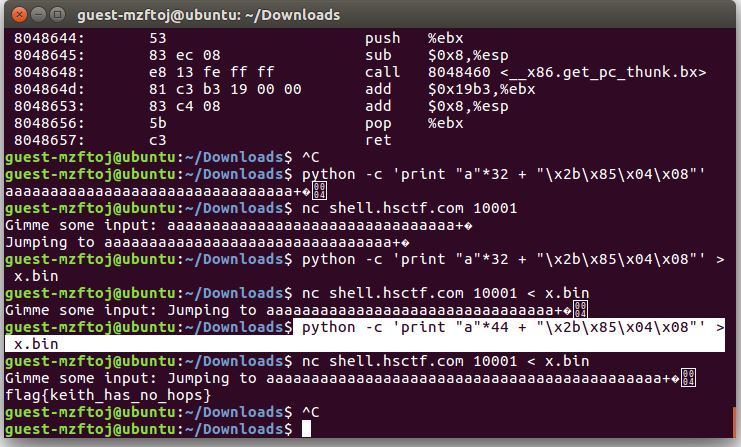

# Jumper

## Challenge

"Feeling nothing / Freely speed up / Landing, Stepping / Jumping, Jumper. Where is Keith hiding? Find out at nc shell.hsctf.com 10001"

## Process

We are given the [elf](jumper_compilation) file for a program as well as the [c file](jumper_code.c] for the program. After looking at the c file we can determine that in order to solve the challenge we need to somehow jump into the lol function from the jumper function. The program uses the functions gets() and printf() which are both vulnerable to a buffer overflow attack. Buffer overflow vulnerablities allow parts of the stack to be over written with arbitrary data.

We want to overwrite the return address of this function as the address of the function flag. From an objectdump of the elf file we can determine that the address for the flag function is 0x0804852b, which we want to jump to. 

However, we don't want to overwrite too much or too little of the stack, so we want to also rewrite a number of random characters before the address of the flag function. I reversed the address of the function flag below in order to account for endianness as well.

First I creaeted a payload which would cause a bufferoverflow into lol and then I inputted the paylolad. I overwrote all of the stack until the return address with a's and rewrote the return address with the address of the function lol. I referenced this website https://dhavalkapil.com/blogs/Buffer-Overflow-Exploit/ while performing the exploit.

The flag is falg{keith_has_no_hops}
