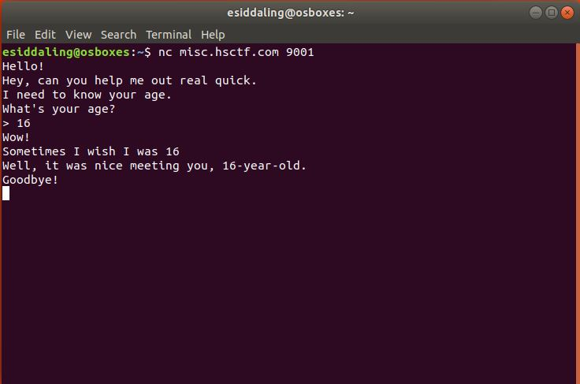
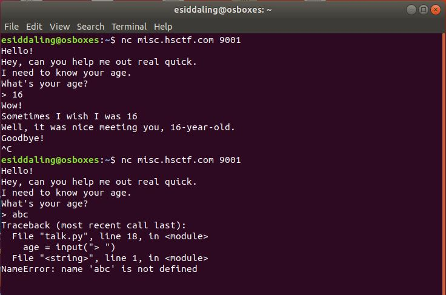
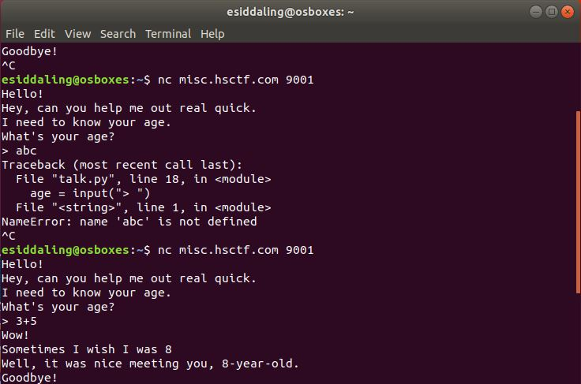
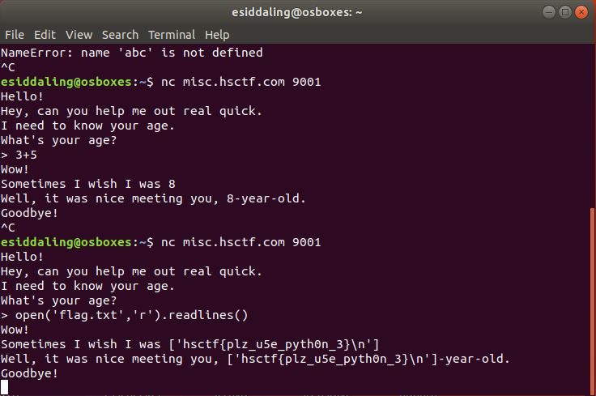

# A Simple Conversation

## Challenge

"Someone on the internet wants to talk to you. Can you find out what they want?
nc misc.hsctf.com 9001"

You can download the file for this problem here [talk.py](talk.py)

## Process

I opened up the given python program and didn't find anything special with the program at first. So it tried inputting different things to look for anything special.
```
#!/usr/bin/env python3
from time import sleep

print("Hello!")

sleep(1)

print("Hey, can you help me out real quick.")

sleep(1)

print("I need to know your age.")

sleep(1)

print("What's your age?")

age = input("> ")

sleep(1)

print("Wow!")

sleep(1)

print("Sometimes I wish I was %s" % age)

sleep(1)

print("Well, it was nice meeting you, %s-year-old." % age)

sleep(1)

print("Goodbye!")
```

Normal numbers worked fine when inputted.



Inputting letters however, caused a crash. Then it hit me, the function input() is a vulnerable function.



Next I tried inputting some math. 



The math was computed actually computed, meaning there is an entry point for an attacker. Upon further research and googling, I learned that using the function input() instead of the function rawinput(), is dangerous. This program does precisely that.

So I tried inputting
```
> open('flag.txt','r').readlines()
```
and I was successful



The flag is hsctf{plz_u5e_pyth0n_3}