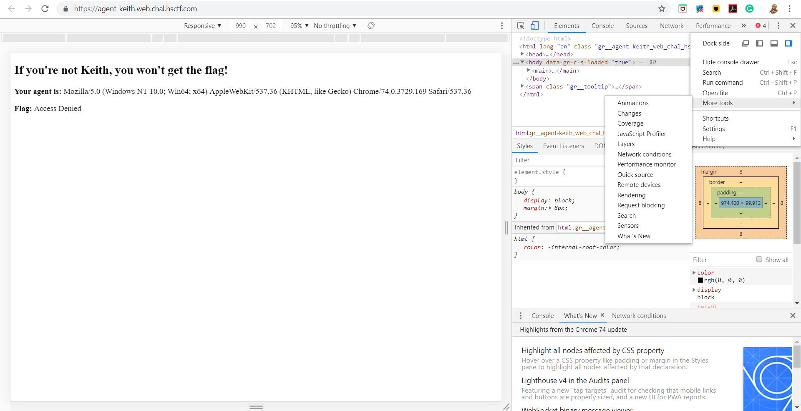
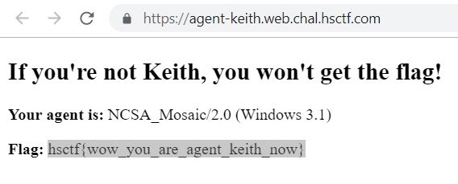

## Agent Keith

## Challenge

"Keith was looking at some old browsers and made a site to hold his flag.

https://agent-keith.web.chal.hsctf.com"

## Process

I went to the website.

I'm not immediately given the flag, but my user agent is displayed, implying that this is a user agent challenge. My user agent is currently "Mozilla/5.0 (Windows NT 10.0; Win64; x64) AppleWebKit/537.36 (KHTML, like Gecko) Chrome/74.0.3729.169 Safari/537.36".

I checked the source of the website and found the user agent of keith as NCSA_Mosaic/2.0 (Windows 3.1).

I changed my user agent to Keith's. 

ctrl shift i > vertical 3 dots > more tools > network conditions > uncheck select automatically and insert the agent in custom > refresh

The flag is hsctf{wow_you_are_agent_keith_now}.
