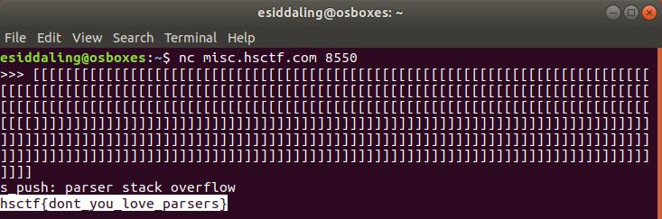

# Broken REPL

## Challenge

"My friend says that there is a bug in my REPL. Can you help me find it?"

nc misc.hsctf.com 8550

You can download the file from the problem here [repl.py](repl.py)

## Process

I opened up the python file and looked at it. At first everything seemed normal.

```
#!/usr/bin/env python3
with open("flag.txt") as flag: # open flag file
    flag = flag.read() # read contents of flag file
try: # make sure we don't run out of memory
    while 1: # do this forever
        try: # try to read a line of input
            line = input(">>> ") # prompt is python's standard prompt
        except EOFError: # user is done typing input
            print() # ensure there is a line-break
            break # exit from the loop
        else: # successfully read input
            try: # try to compile the input
                code = compile(line, "<input>", "exec") # compile the line of input
            except (OverflowError, SyntaxError, ValueError, TypeError, RecursionError) as e: # user input was bad
                print("there was an error in your code:", e) # notify the user of the error
            if False: exec(code) # run the code
            # TODO: find replacement for exec
            # TODO: exec is unsafe
except MemoryError: # we ran out of memory
    # uh oh
    # lets remove the flag to clear up some memory
    print(flag) # log the flag so it is not lost
    del flag # delete the flag
    # hopefully we have enough memory now
```
What to do when many exceptions were raised was define so I read up on the python exceptions [here](https://docs.python.org/2/library/exceptions.html).


One of the comments expalined that if there was not enough memory, a memory error would occur and the flag would be printed and deleted in order to salvage the repl. Therefore, if I could cause a memory error, the flag would be printed. 

I inputted lots of square brackets in order to cause a memory error and get the flag.



The flag is hsctf{dont_you_love_parsers}