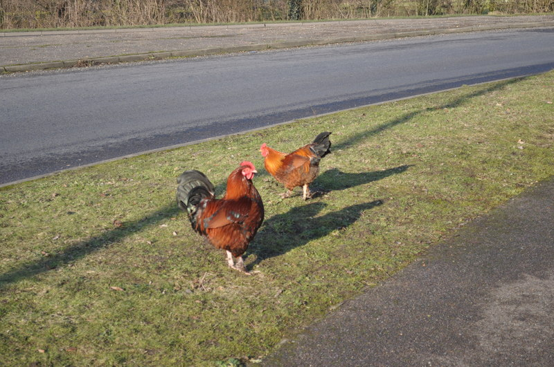
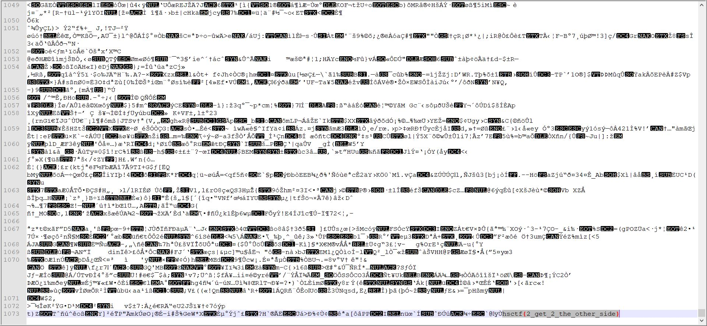

# Chicken Crossing

## Challenge

"Keith is watching chickens cross a road in his grandfather’s farm. He once heard from his grandfather that there was something significant about this behavior, but he can’t figure out why. Help Keith discover what the chickens are doing from this seemingly simple behavior."

You can download the problem file here [hsctf-chicken_crossing.jpg](hsctf-chicken_crossing.jpg)

## Process

I opened up the attached image and found nothing special.



I then looked in the file with notepad++ and searched the file with ctrl-f for hsctf{. 



Looking back I could have just as easily ran strings on the file and used grep on the file.

```
$ strings hsctf-chicken_crossing.jpg | grep hsctf{
```

The flag is hsctf{2_get_2_the_other_side}