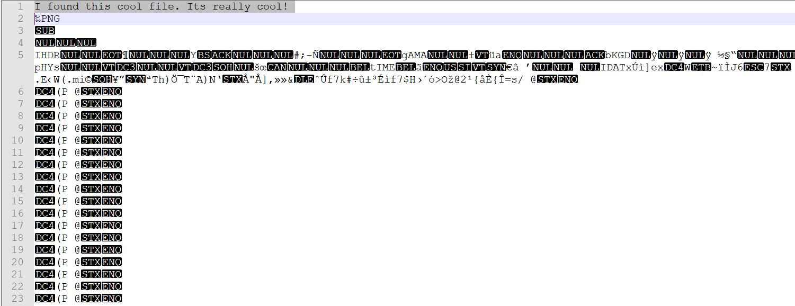

# Cool Image 2

## Challenge

"My friend sent me this image, but I can't open it. Can you help me open the image?"
You can download the file for this problem here [cool.pdf](cool.pdf)

## Process

At first, if we try to open this file PNG file, we are told that it will not open because it is damaged or the file tpe is not recognized. If we open up the file in notepad++, we can notice something strange on the first line. 

The first line is "I found this cool file. Its really cool!", not ‰PNG. This line does not seem to belong here so I deleted it and saved the file as [coolpostdelete.png](coolpostdelete.png). The new file, cool.png successfully opens and clearly displays the flag.

The flag is hsctf{sorry_about_the_extra_bytes}.