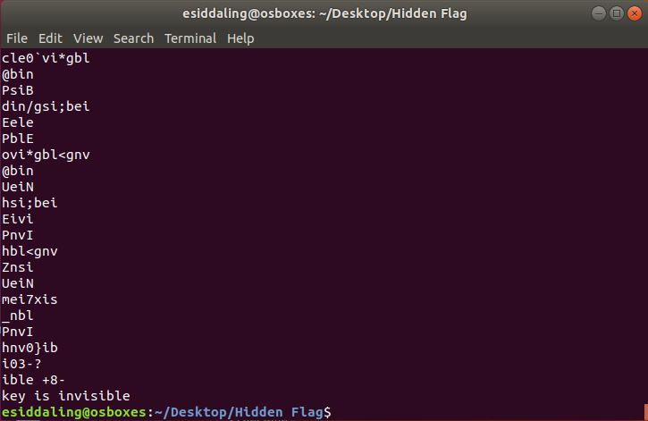

# Hidden Flag

## Challenge

"This image seems wrong.....did Keith lose the key again?"
You can download the file for this problem here [chall.png](chall.jpg)

## Process

I tried opening chall.png and found that it doesn't open and is possibly damaged.

I ran strings on the image and found a line saying "key is invisible"
```
$ strings slap.jpg | grep hsctf{
```



I wrote [this](xor.py) python program to xor the origional image with the key invisible.
```
import pwn

#Xor the origional image
challpng = open("chall.png")
challpng = challpng.read()
fixed = pwn.xor(challpng, "invisible")

#Write the new image
fixedpng = open("fixed.png", "w")
fixedpng.write(fixed)
print("fixed.png has been created")
```

I then opened up the new image and found the flag clearly displayed on it.


The flag is hsctf{n0t_1nv1s1bl3_an5m0r3?-39547632}