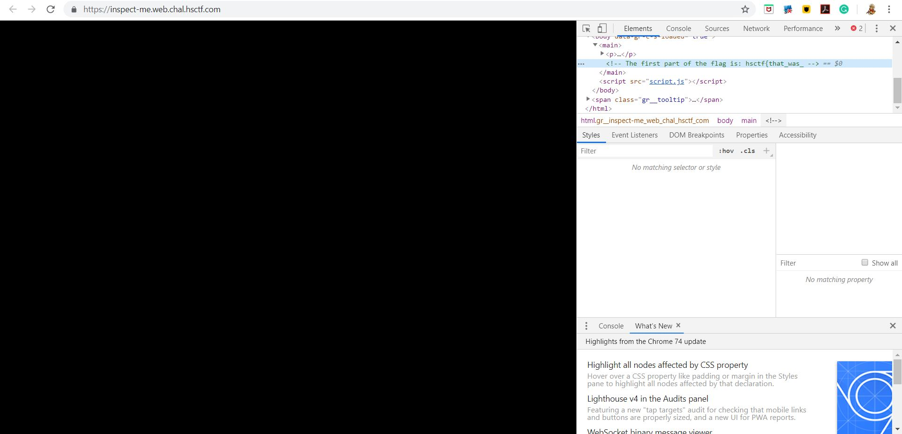
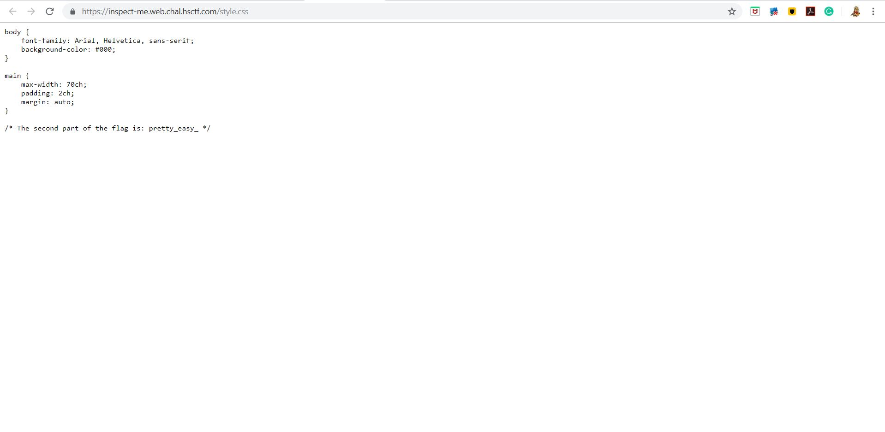
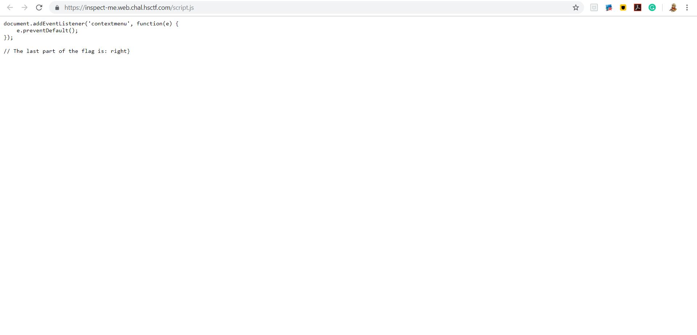

# Inspect Me

## Challenge

Keith's little brother messed up some things...

https://inspect-me.web.chal.hsctf.com

Note: There are 3 parts to the flag!

## Process

I went to the site and found a totally black page. I then used ctrl-shitf-i to open up inspect element and looked for parts of the flag.

The first part of the flag is: hsctf{that_was_ and is found on the webpage itself.

The second part of the flag is: pretty_easy_ and is found in the css file.

The last part of the flag is: right} and is found in the js file.

The flag is hsctf{that_was_pretty_easy_right}
