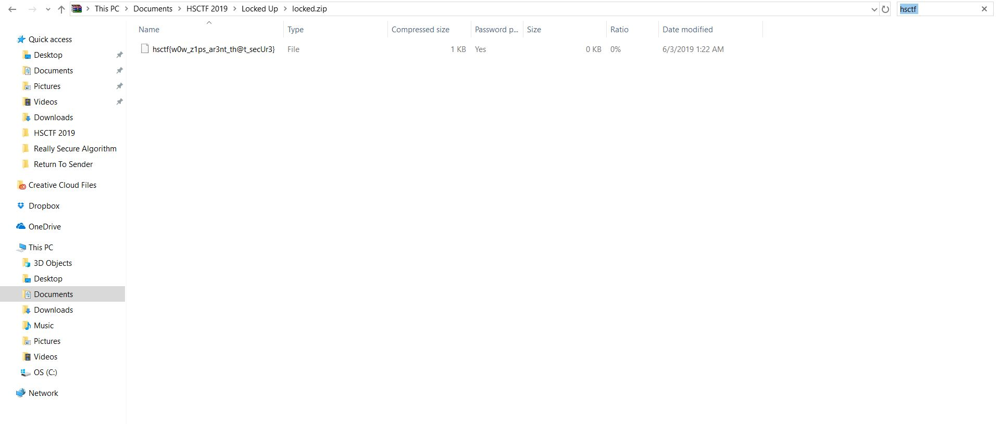

# Locked Up

## Challenge

"My friend gave me a zip file with the flag in it, but the zip file is encrypted. Can you help me open the zip file?"

You can download the problem file here [locked.zip](locked.zip)

## Process

At first I tried bruteforcing the password of the zip file with the following fcrackzip command. However this was taking an extremely long time, so I realized that the password of the file must not matter.

```
$ fcrackzip -b -c 'a' -l 1-16 -u locked.zip
```

I tried opening the zip file in file explorer and searched for 'hsctf'. It was that simple in the end.



Looking back I also could have just used strings and grep on the file to find the flag.

```
$ strings locked.zip | grep hsctf{
```

The flag is hsctf{w0w_z1ps_ar3nt_th@t_secUr3}