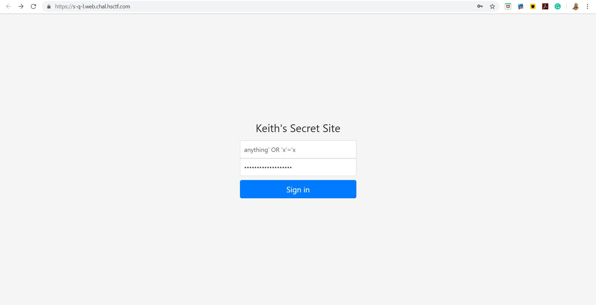
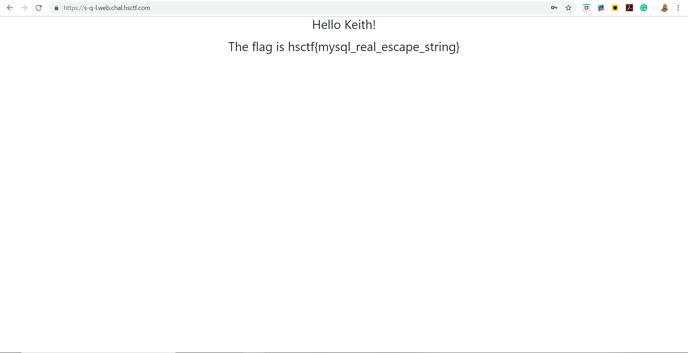

# S-Q-L

## Challenge

"Keith keeps trying to keep his flag safe. This time, he used a database and some PHP.

https://s-q-l.web.chal.hsctf.com/"

## Process

From the title of this challenge, we can determine that this challenge is an SQL inject challenge. I read up on SQL injections [here](http://www.unixwiz.net/techtips/sql-injection.html)

I then plugged in "anything' OR 'x'='x" into the username and password of the signin page and got the flag.

The flag is hsctf{mysql_real_escape_string}

