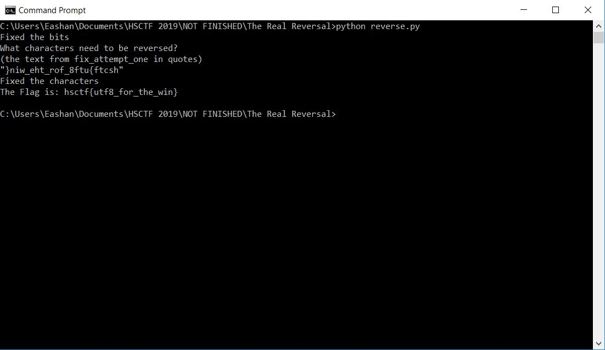

# The Real Reversal

## Challenge

"My friend gave me some fancy text, but it was reversed, and so I tried to reverse it but I think I messed it up further. Can you find out what the text says?"

You can download the file for this problem here [reversed.txt](reversed.txt)

## Process

I tried opening the file and found lots of strange characters. I guessed the bits of the file were reversed, so I wrote [this](reverse.py) to fix them.

```
#Script for The Real Reversal
#Look at the bits of the given file
reversed = open('reversed.txt', 'rb')
reversedBits = reversed.read()
#Reverse the bits of the given file and write a new one
bits = reversedBits[::-1]
outputText = open('fix_attempt_one.txt','wb')
outputText.write(bits)
reversed.close()
outputText.close()
print("Fixed the bits")

#This gives us Latin characters in fixed_attempt_one.txt, but the characters are reversed. We can tell by the strange punctuation. The challenge also says that someone reversed the file twice.
#After looking through the text I determined that "}niw_eht_rof_8ftu{ftcsh" is likely the flag reversed

#For some strange reason, no matter what I did the file wouldn't be read as ascii characters with the line below, so I made a workaround using input() and retyping the reversed flag. This may have something to do with the fact that the written text appears like its in a strange font of some kind. }niw_eht_rof_8ftu{ftcsh 
#flipped = open('fix_attempt_one.txt','r')

reversedCharacters = str(input("What characters need to be reversed?\n(the text from fix_attempt_one in quotes) \n"))
#Reverse the characters from the new file 
characters = reversedCharacters[::-1]
print("Fixed the characters")
print("The Flag is: " +  str(characters))

#The flag is hsctf{utf8_for_the_win}
```

However, the latin characters were also reversed in [fix_attempt_one.txt](fix_attempt_one, so I made sure to reverse the characters as well in my python script.

```
.𝚖𝚞𝚛𝚘𝚋𝚊𝚕 𝚝𝚜𝚎 𝚍𝚒 𝚖𝚒𝚗𝚊 𝚝𝚒𝚕𝚕𝚘𝚖 𝚝𝚗𝚞𝚛𝚎𝚜𝚎𝚍 𝚊𝚒𝚌𝚒𝚏𝚏𝚘 𝚒𝚞𝚚 𝚊𝚙𝚕𝚞𝚌 𝚗𝚒 𝚝𝚗𝚞𝚜 ,𝚝𝚗𝚎𝚍𝚒𝚘𝚛𝚙 𝚗𝚘𝚗 𝚝𝚊𝚝𝚊𝚍𝚒𝚙𝚞𝚌 𝚝𝚊𝚌𝚎𝚊𝚌𝚌𝚘 𝚝𝚗𝚒𝚜 𝚛𝚞𝚎𝚝𝚙𝚎𝚌𝚡𝙴 .𝚛𝚞𝚝𝚊𝚒𝚛𝚊𝚙 𝚊𝚕𝚕𝚞𝚗 𝚝𝚊𝚒𝚐𝚞𝚏 𝚞𝚎 𝚎𝚛𝚘𝚕𝚘𝚍 𝚖𝚞𝚕𝚕𝚒𝚌 𝚎𝚜𝚜𝚎 𝚝𝚒𝚕𝚎𝚟 𝚎𝚝𝚊𝚝𝚙𝚞𝚕𝚘𝚟 𝚗𝚒 𝚝𝚒𝚛𝚎𝚍𝚗𝚎𝚑𝚎𝚛𝚙𝚎𝚛 𝚗𝚒 𝚛𝚘𝚕𝚘𝚍 𝚎𝚛𝚞𝚛𝚒 𝚎𝚝𝚞𝚊 𝚜𝚒𝚞𝙳 .𝚝𝚊𝚞𝚚𝚎𝚜𝚗𝚘𝚌 𝚘𝚍𝚘𝚖𝚖𝚘𝚌 𝚊𝚎 𝚡𝚎 𝚙𝚒𝚞𝚚𝚒𝚕𝚊 𝚝𝚞 𝚒𝚜𝚒𝚗 𝚜𝚒𝚛𝚘𝚋𝚊𝚕 𝚘𝚌𝚖𝚊𝚕𝚕𝚞 𝚗𝚘𝚒𝚝𝚊𝚝𝚒𝚌𝚛𝚎𝚡𝚎 𝚍𝚞𝚛𝚝𝚜𝚘𝚗 𝚜𝚒𝚞𝚚 ,𝚖𝚊𝚒𝚗𝚎𝚟 𝚖𝚒𝚗𝚒𝚖 𝚍𝚊 𝚖𝚒𝚗𝚎 𝚝𝚄 .𝚊𝚞𝚚𝚒𝚕𝚊 𝚊𝚗𝚐𝚊𝚖 𝚎𝚛𝚘𝚕𝚘𝚍 𝚝𝚎 𝚎𝚛𝚘𝚋𝚊𝚕 𝚝𝚞 𝚝𝚗𝚞𝚍𝚒𝚍𝚒𝚌𝚗𝚒 𝚛𝚘𝚙𝚖𝚎𝚝 𝚍𝚘𝚖𝚜𝚞𝚒𝚎 𝚘𝚍 𝚍𝚎𝚜 ,𝚝𝚒𝚕𝚎 𝚐𝚗𝚒𝚌𝚜𝚒𝚙𝚒𝚍𝚊 𝚛𝚞𝚝𝚎𝚝𝚌𝚎𝚜𝚗𝚘𝚌 ,𝚝𝚎𝚖𝚊 𝚝𝚒𝚜 𝚛𝚘𝚕𝚘𝚍 𝚖𝚞𝚜𝚙𝚒 𝚖𝚎𝚛𝚘𝙻 .𝚖𝚞𝚛𝚘𝚋𝚊𝚕 𝚝𝚜𝚎 𝚍𝚒 𝚖𝚒𝚗𝚊 𝚝𝚒𝚕𝚕𝚘𝚖 𝚝𝚗𝚞𝚛𝚎𝚜𝚎𝚍 𝚊𝚒𝚌𝚒𝚏𝚏𝚘 𝚒𝚞𝚚 𝚊𝚙𝚕𝚞𝚌 𝚗𝚒 𝚝𝚗𝚞𝚜 ,𝚝𝚗𝚎𝚍𝚒𝚘𝚛𝚙 𝚗𝚘𝚗 𝚝𝚊𝚝𝚊𝚍𝚒𝚙𝚞𝚌 𝚝𝚊𝚌𝚎𝚊𝚌𝚌𝚘 𝚝𝚗𝚒𝚜 𝚛𝚞𝚎𝚝𝚙𝚎𝚌𝚡𝙴 .𝚛𝚞𝚝𝚊𝚒𝚛𝚊𝚙 𝚊𝚕𝚕𝚞𝚗 𝚝𝚊𝚒𝚐𝚞𝚏 𝚞𝚎 𝚎𝚛𝚘𝚕𝚘𝚍 𝚖𝚞𝚕𝚕𝚒𝚌 𝚎𝚜𝚜𝚎 𝚝𝚒𝚕𝚎𝚟 𝚎𝚝𝚊𝚝𝚙𝚞𝚕𝚘𝚟 𝚗𝚒 𝚝𝚒𝚛𝚎𝚍𝚗𝚎𝚑𝚎𝚛𝚙𝚎𝚛 𝚗𝚒 𝚛𝚘𝚕𝚘𝚍 𝚎𝚛𝚞𝚛𝚒 𝚎𝚝𝚞𝚊 𝚜𝚒𝚞𝙳 .𝚝𝚊𝚞𝚚𝚎𝚜𝚗𝚘𝚌 𝚘𝚍𝚘𝚖𝚖𝚘𝚌 𝚊𝚎 𝚡𝚎 𝚙𝚒𝚞𝚚𝚒𝚕𝚊 𝚝𝚞 𝚒𝚜𝚒𝚗 𝚜𝚒𝚛𝚘𝚋𝚊𝚕 𝚘𝚌𝚖𝚊𝚕𝚕𝚞 𝚗𝚘𝚒𝚝𝚊𝚝𝚒𝚌𝚛𝚎𝚡𝚎 𝚍𝚞𝚛𝚝𝚜𝚘𝚗 𝚜𝚒𝚞𝚚 ,𝚖𝚊𝚒𝚗𝚎𝚟 𝚖𝚒𝚗𝚒𝚖 𝚍𝚊 𝚖𝚒𝚗𝚎 𝚝𝚄 .𝚊𝚞𝚚𝚒𝚕𝚊 𝚊𝚗𝚐𝚊𝚖 𝚎𝚛𝚘𝚕𝚘𝚍 𝚝𝚎 𝚎𝚛𝚘𝚋𝚊𝚕 𝚝𝚞 𝚝𝚗𝚞𝚍𝚒𝚍𝚒𝚌𝚗𝚒 𝚛𝚘𝚙𝚖𝚎𝚝 𝚍𝚘𝚖𝚜𝚞𝚒𝚎 𝚘𝚍 𝚍𝚎𝚜 ,𝚝𝚒𝚕𝚎 𝚐𝚗𝚒𝚌𝚜𝚒𝚙𝚒𝚍𝚊 𝚛𝚞𝚝𝚎𝚝𝚌𝚎𝚜𝚗𝚘𝚌 ,𝚝𝚎𝚖𝚊 𝚝𝚒𝚜 𝚛𝚘𝚕𝚘𝚍 𝚖𝚞𝚜𝚙𝚒 𝚖𝚎𝚛𝚘𝙻 .𝚜𝚛𝚎𝚝𝚝𝚎𝚕 𝚒𝚒𝚌𝚜𝚊 𝚛𝚊𝚕𝚞𝚐𝚎𝚛 𝚐𝚗𝚒𝚜𝚞 ,}𝚗𝚒𝚠_𝚎𝚑𝚝_𝚛𝚘𝚏_𝟾𝚏𝚝𝚞{𝚏𝚝𝚌𝚜𝚑 𝚜𝚒 𝚐𝚊𝚕𝚏 𝚎𝚑𝚃 .𝚖𝚞𝚛𝚘𝚋𝚊𝚕 𝚝𝚜𝚎 𝚍𝚒 𝚖𝚒𝚗𝚊 𝚝𝚒𝚕𝚕𝚘𝚖 𝚝𝚗𝚞𝚛𝚎𝚜𝚎𝚍 𝚊𝚒𝚌𝚒𝚏𝚏𝚘 𝚒𝚞𝚚 𝚊𝚙𝚕𝚞𝚌 𝚗𝚒 𝚝𝚗𝚞𝚜 ,𝚝𝚗𝚎𝚍𝚒𝚘𝚛𝚙 𝚗𝚘𝚗 𝚝𝚊𝚝𝚊𝚍𝚒𝚙𝚞𝚌 𝚝𝚊𝚌𝚎𝚊𝚌𝚌𝚘 𝚝𝚗𝚒𝚜 𝚛𝚞𝚎𝚝𝚙𝚎𝚌𝚡𝙴 .𝚛𝚞𝚝𝚊𝚒𝚛𝚊𝚙 𝚊𝚕𝚕𝚞𝚗 𝚝𝚊𝚒𝚐𝚞𝚏 𝚞𝚎 𝚎𝚛𝚘𝚕𝚘𝚍 𝚖𝚞𝚕𝚕𝚒𝚌 𝚎𝚜𝚜𝚎 𝚝𝚒𝚕𝚎𝚟 𝚎𝚝𝚊𝚝𝚙𝚞𝚕𝚘𝚟 𝚗𝚒 𝚝𝚒𝚛𝚎𝚍𝚗𝚎𝚑𝚎𝚛𝚙𝚎𝚛 𝚗𝚒 𝚛𝚘𝚕𝚘𝚍 𝚎𝚛𝚞𝚛𝚒 𝚎𝚝𝚞𝚊 𝚜𝚒𝚞𝙳 .𝚝𝚊𝚞𝚚𝚎𝚜𝚗𝚘𝚌 𝚘𝚍𝚘𝚖𝚖𝚘𝚌 𝚊𝚎 𝚡𝚎 𝚙𝚒𝚞𝚚𝚒𝚕𝚊 𝚝𝚞 𝚒𝚜𝚒𝚗 𝚜𝚒𝚛𝚘𝚋𝚊𝚕 𝚘𝚌𝚖𝚊𝚕𝚕𝚞 𝚗𝚘𝚒𝚝𝚊𝚝𝚒𝚌𝚛𝚎𝚡𝚎 𝚍𝚞𝚛𝚝𝚜𝚘𝚗 𝚜𝚒𝚞𝚚 ,𝚖𝚊𝚒𝚗𝚎𝚟 𝚖𝚒𝚗𝚒𝚖 𝚍𝚊 𝚖𝚒𝚗𝚎 𝚝𝚄 .𝚊𝚞𝚚𝚒𝚕𝚊 𝚊𝚗𝚐𝚊𝚖 𝚎𝚛𝚘𝚕𝚘𝚍 𝚝𝚎 𝚎𝚛𝚘𝚋𝚊𝚕 𝚝𝚞 𝚝𝚗𝚞𝚍𝚒𝚍𝚒𝚌𝚗𝚒 𝚛𝚘𝚙𝚖𝚎𝚝 𝚍𝚘𝚖𝚜𝚞𝚒𝚎 𝚘𝚍 𝚍𝚎𝚜 ,𝚝𝚒𝚕𝚎 𝚐𝚗𝚒𝚌𝚜𝚒𝚙𝚒𝚍𝚊 𝚛𝚞𝚝𝚎𝚝𝚌𝚎𝚜𝚗𝚘𝚌 ,𝚝𝚎𝚖𝚊 𝚝𝚒𝚜 𝚛𝚘𝚕𝚘𝚍 𝚖𝚞𝚜𝚙𝚒 𝚖𝚎𝚛𝚘𝙻 .𝚕𝚘𝚘𝚌 𝚘𝚜 𝚢𝚕𝚕𝚊𝚞𝚝𝚌𝚊 𝚜𝚒 𝚜𝚒𝚑𝚃 .𝚜𝚍𝚛𝚊𝚠𝚔𝚌𝚊𝚋 𝚜𝚒 𝚝𝚡𝚎𝚝 𝚢𝚖 𝚏𝚘 𝚕𝚕𝙰 .𝚕𝚘𝚘𝚌 𝚜𝚒 𝚜𝚒𝚑𝚝 𝚠𝚘𝚆
```

However my script had some issues interpretting the uft8 text in the output file, so I used a work around with the input() function.



The flag is hsctf{utf8_for_the_win}