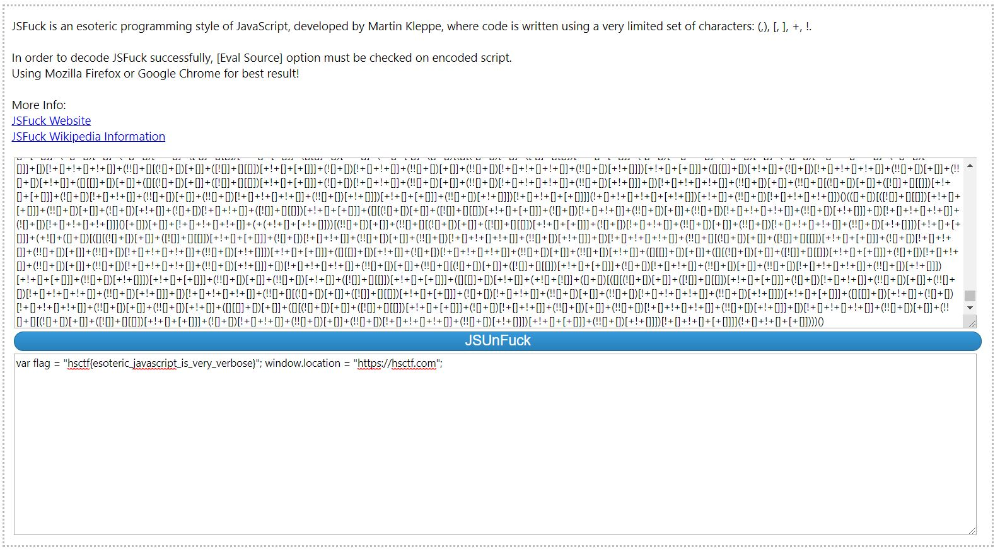

# Verbose

## Challenge

"My friend sent me this file, but I don't understand what I can do with these 6 different characters..."

You can download the problem file here [verbose.txt](verbose.txt)

## Process

I opened the file, and found some kind of esoteric language completely comprised of brackets, parenthesis, exclamation points, and plus signs.

I googled brackets, parenthesis, exclamation point, and plus sign language and found out that this esoteric language is called jsfuck [here](https://stackoverflow.com/questions/25622221/language-made-only-of-brackets-plus-and-exclamation-marks).

I then used http://codertab.com/jsunfuck to find the flag. 

get var flag = "hsctf{esoteric_javascript_is_very_verbose}"; window.location = "https://hsctf.com";

Th flag is hsctf{esoteric_javascript_is_very_verbose}