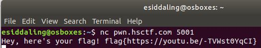

# Intro to Netcat 2: Electric Boogaloo

## Challenge

"Intro to Netcat was too difficult, seeing as 32% of teams failed to solve it.

To get the flag, install Netcat.

nc pwn.hsctf.com 5001"

## Process

Simply connect to the address to get the flag.

```
$ nc pwn.hsctf.com 5001
```



The flag is flag{https://youtu.be/-TVWst0YqCI}