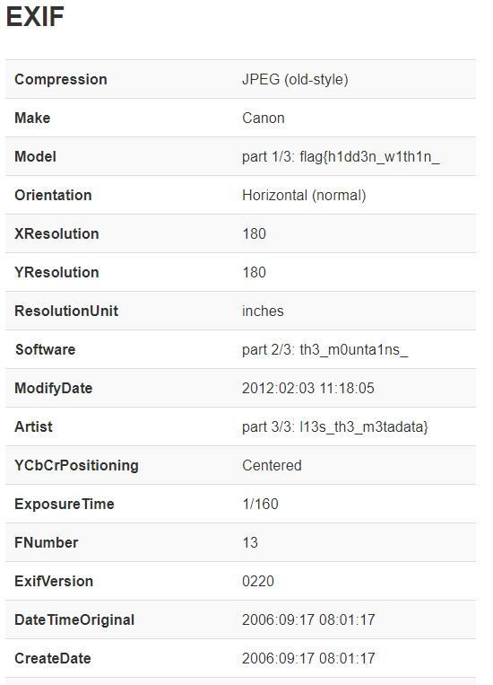

# Meta MountainsMeta Mountains

## Challenge

"It seems that mountains are a great place for hiding secrets. Maybe you could find this one!"

You can download the problem files here [mountains_hsctf.jpg](mountains_hsctf.jpg)

## Process

You don't see anything interesting when opening the image normally. However, based on the title of this challenge, the flag is likely hidden in the metadata of the image.

Using the metadata viewer at http://metapicz.com/#landing you can find all three parts of the flag under EXIF data.

The flag is flag{h1dd3n_w1th1n_th3_m0unta1ns_l13s_th3_m3tadata}