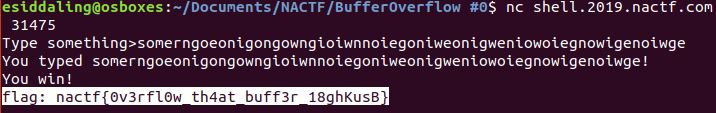

# BufferOverflow #0

## Challenge

"The close cousin of a website for 'Question marked as duplicate'

Can you cause a segfault and get the flag?

shell.2019.nactf.com:31475"

You can download the problem files here [bufover-0.c](bufover-0.c) [bufover-0](bufover-0)

## Process

This is a buffer overflow challenge. You get the flag by supplying too many characters to the vulnerable function printf. It does not matter waht the characters are. This also causes a segfault error.

The flag is: nactf{0v3rfl0w_th4at_buff3r_18ghKusB}
