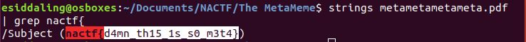

# The MetaMeme

## Challenge

"Phil sent me this meme and its a little but suspicious. The meme is super meta and it may be even more meta than you think.

Wouldn't it be really cool if it also had a flag hidden somewhere in it? Well you are in luck because it certainly does!"

You can download the problem file here [metametametameta.pdf](metametametameta.pdf)

## Process

The challenge description said the flag was somewhere in the file, so I used strings and grep to find the flag.

```
$ strings metametametameta.pdf | grep nactf{
```



The flag is nactf{d4mn_th15_1s_s0_m3t4}
