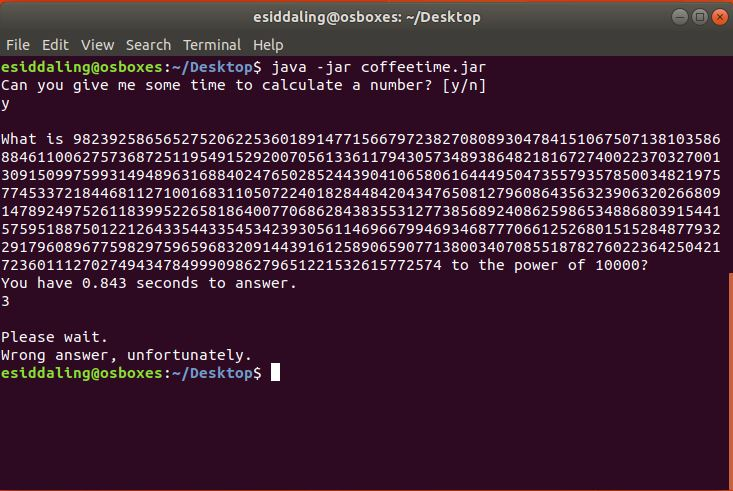
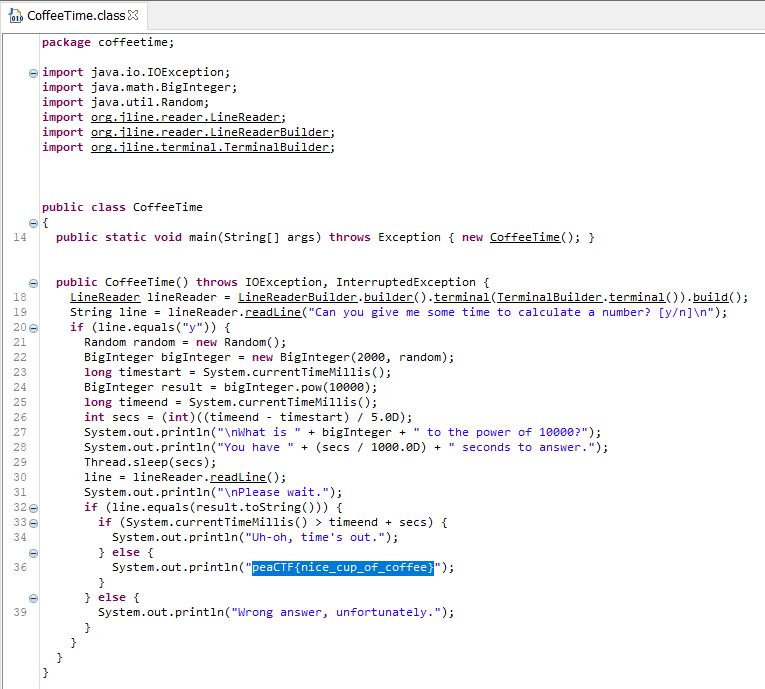

# Coffee Time

## Challenge

"Run this jar executable in a virtual machine and see what happens. [coffeetime.jar](coffeetime.jar)"

## Process

I opened the file in notepad++ and found that it is a compiled java file. I tried running the jar file and realized doing the mathematical calculation the program wanted in the time period is impossible.

Next I tried decompiling the jar file with the tool jd-gui-1.6.3.jar. I found the flag in the decompilation.

The flag is peaCTF{nice_cup_of_coffee}