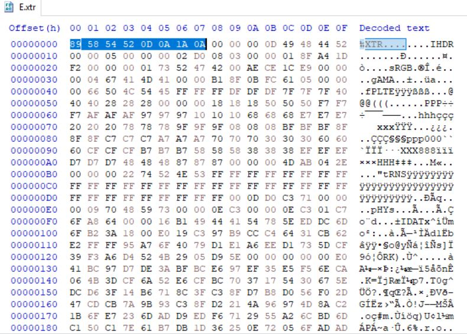
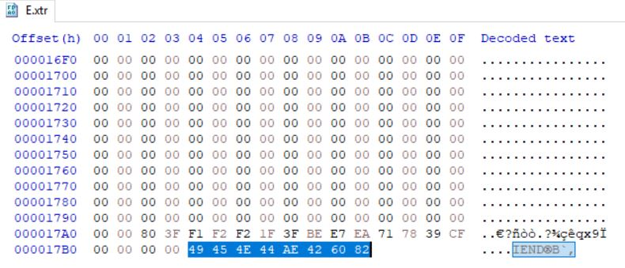
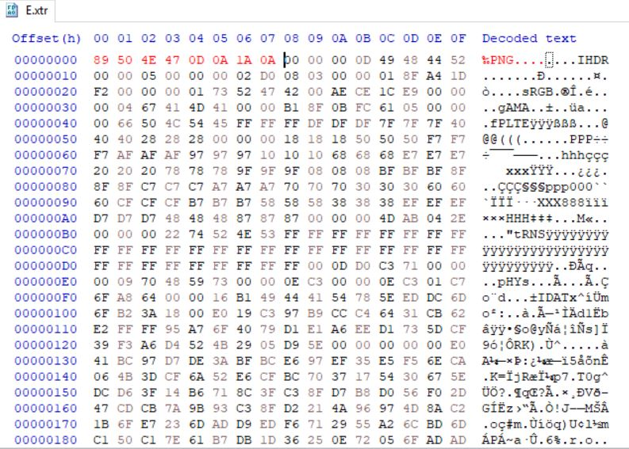

# E.xtr

## Challenge

[E.xtr](E.xtr)

## Process

First I tried googling .xtr files. I could not come up with anything about them, so I tried opening [E.xtr](E.xtr) with a hex editor and looking at its file header.

I could not find the file header 89 58 54 52 0D 0A 1A 0A on the internet either. However, the file had the file footer of a .png file, 49 45 4E 44 AE 42 60 82.

I changed the file header to a .png file's header, 89 50 4E 47 0D 0A 1A 0A, and saved the file as [flag.png](flag.png).

The flag was displayed in [flag.png](flag.png).

The flag is {read_banned_it}