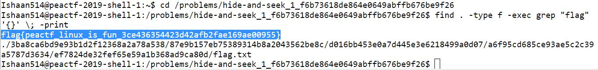

# Hide and Seek

## Challenge

"Try to find to the flag file located somewhere in the folders located in: /problems/hide-and-seek_1_f6b73618de864e0649abffb676be9f26"

## Process

I ran the following commands to find the flag on the Peactf shell.

```
$ cd /problems/hide-and-seek_1_f6b73618de864e0649abffb676be9f26
```

```
$ find . -type f -exec grep "flag" '{}' \; -print
```



The flag is flag{peactf_linux_is_fun_3ce436354423d42afb2fae169ae00955}.