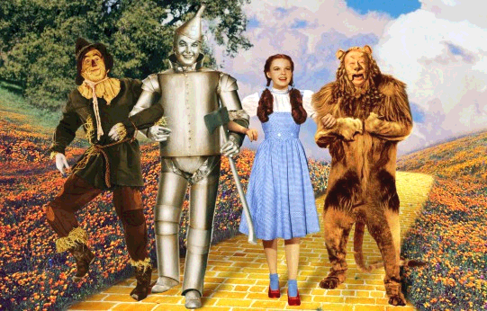
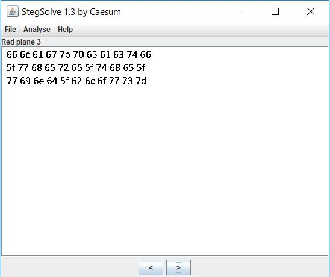

# The Wonderful Wizard

# Challenge

"[TheWonderfulWizard](TheWonderfulWizard.png)"

# Process

First I tried opening the image, but I found nothing interesting.



I then tried using stegsolve to look for anything interesting. I found the following hex values under the Red Plane 3 setting of stegsolve.

```
66 6c 61 67 7b 70 65 61 63 74 66
5f 77 68 65 72 65 5f 74 68 65 5f
77 69 6e 64 5f 62 6c 6f 77 73 7d
```



I then converted the hex values to ascii with this website https://www.rapidtables.com/convert/number/hex-to-ascii.html

The flag is flag{peactf_where_the_wind_blows}.