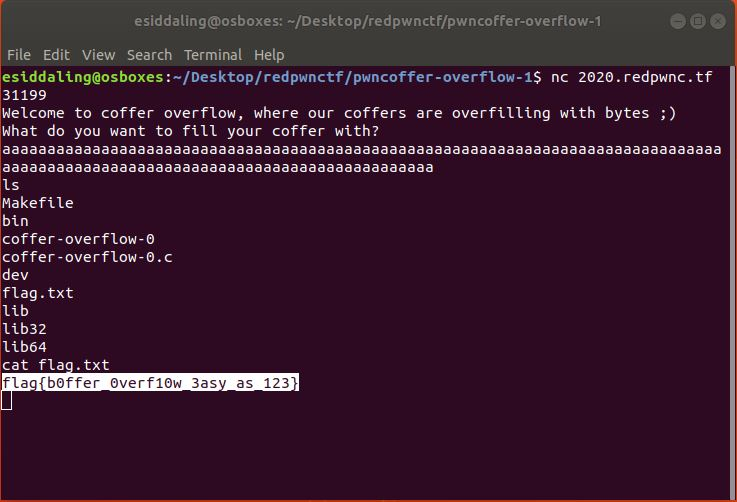

# pwncoffer-overflow-0

## Challenge

"Can you fill up the coffers We even managed to find the source for you.

nc 2020.redpwnc.tf 31199"

You can download the problem files here [coffer-overflow-0](coffer-overflow-0)[coffer-overflow-0.c](coffer-overflow-0.c)

## Process

Coffer-overflow is title that implies a buffer overflow attack. I opened up the .c file and looked for anything interesting.

```
#include <stdio.h>
#include <string.h>

int main(void)
{
  long code = 0;
  char name[16];
  
  setbuf(stdout, NULL);
  setbuf(stdin, NULL);
  setbuf(stderr, NULL);

  puts("Welcome to coffer overflow, where our coffers are overfilling with bytes ;)");
  puts("What do you want to fill your coffer with?");

  gets(name);

  if(code != 0) {
    system("/bin/sh");
  }
}
```

The lines below are important to the buffer overflow. The variable named code is defined as zero, and you can obtain shell capabilities if its value is changed. 

```
  long code = 0;
...
  gets(name);
...
  if(code != 0) {
    system("/bin/sh");
``

Inputting lots of characters will overwrite the variable code and make it no longer equal to zero. Once this occurs you can obtain shell capabilities. The flag can then be found and displayed.



The flag is flag{b0ffer_0verf10w_3asy_as_123}