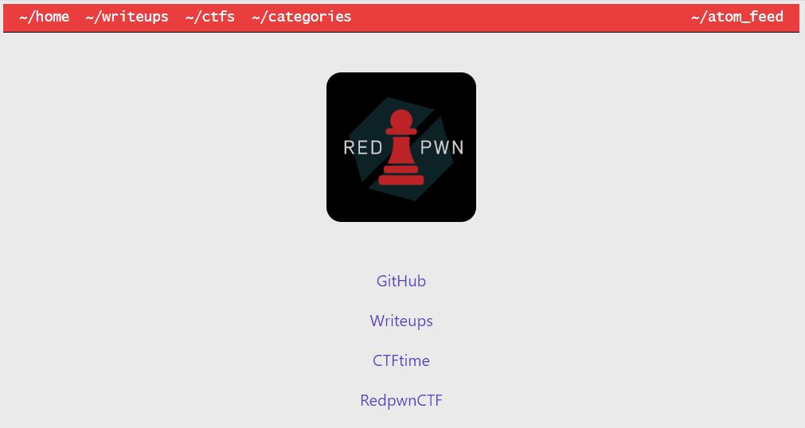

# webinspector-general

## Challenge

"My friend made a new (webpage)[https://redpwn.net/], can you find a flag?"

## Process

When you go to the given webpage, nothing immediately catches attention. However the challenge title implies that the flag can be found by viewing the page source.

The flag can be found be viewing the page source.

The flag is flag{1nspector_g3n3ral_at_w0rk}.